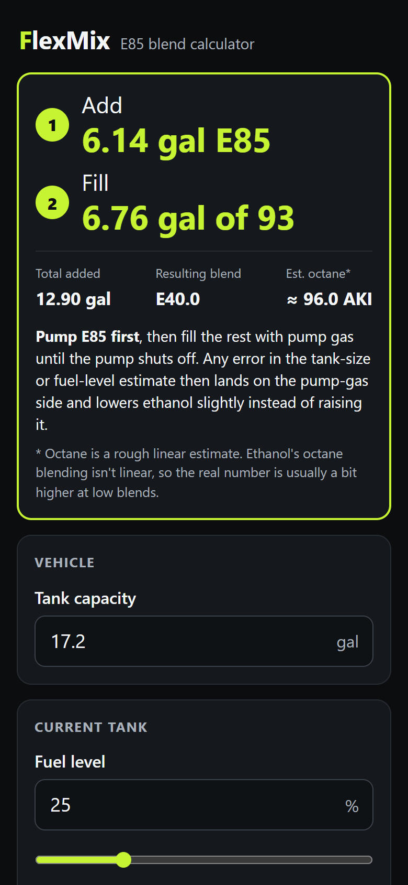
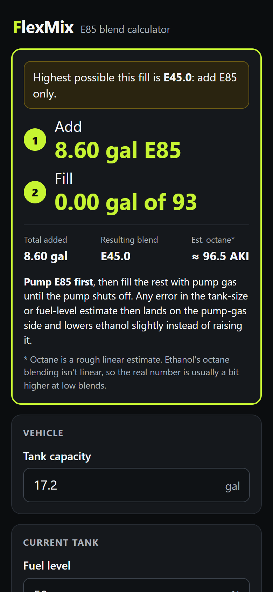
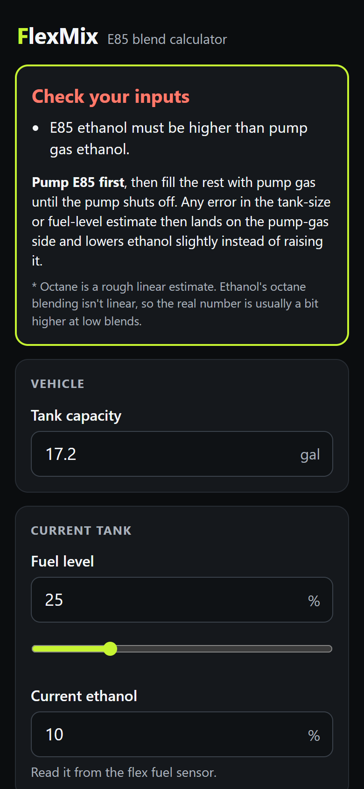
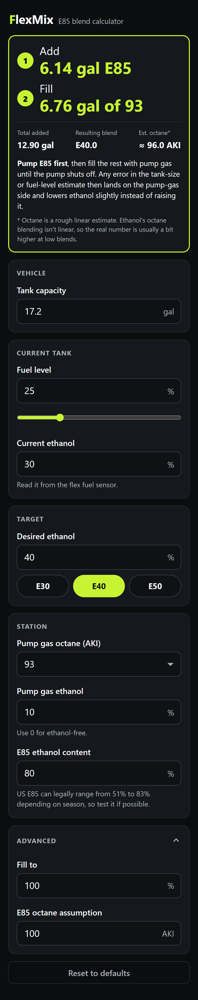

# FlexMix

A small, mobile-first E85 blend calculator. Enter your tank size, how full it is, the ethanol content the flex fuel sensor reports, and the blend you want. FlexMix tells you how many gallons of E85 and pump gas to add.

It's a static site (plain HTML, CSS and ES-module JavaScript with no build step and no external requests) served by `nginx:alpine`. Inputs are saved in the browser's localStorage.

## Screenshots

| Result | Target out of reach | Input validation |
| :---: | :---: | :---: |
|  |  |  |

<details>
<summary>Full page</summary>



</details>

## The math

All percentages are converted to fractions.

| Symbol | Meaning |
| --- | --- |
| C | tank capacity (US gal) |
| L | current fuel level |
| F | fill-to level (default 100%) |
| e0 | current ethanol content |
| et | target ethanol content |
| eg | pump gas ethanol content |
| e85 | E85 ethanol content |

```
V0 = C·L                    fuel in the tank now
Vf = C·F                    fuel after the fill
S  = Vf − V0                gallons to add

x  = (Vf·et − V0·e0 − S·eg) / (e85 − eg)    gallons of E85
y  = S − x                                  gallons of pump gas
blend = (V0·e0 + x·e85 + y·eg) / Vf
```

- If **x < 0**, the target is too low for this fill. The lowest reachable blend is `(V0·e0 + S·eg) / Vf`, and the app shows an all-pump-gas fill.
- If **x > S**, the target is too high. The highest reachable blend is `(V0·e0 + S·e85) / Vf`, and the app shows an all-E85 fill.

Estimated octane is a linear interpolation, and only a rough guide:

```
AKI ≈ pumpAKI + (blend − eg) / (e85 − eg) × (e85AKI − pumpAKI)
```

Ethanol's octane blending isn't linear, so the real number is usually a bit higher at low blends.

**Pump order:** pump the E85 first, then fill the rest with pump gas until the pump shuts off. Any error in the tank-size or fuel-level estimate then lands on the pump-gas side and lowers the ethanol slightly instead of raising it.

## Project layout

```
src/            web root (copied into the image)
  index.html
  app.js        DOM wiring, localStorage
  calc.js       pure math + validation (unit tested)
  styles.css
  manifest.webmanifest, icon.svg
tests/calc.test.js
Dockerfile, nginx.conf, docker-compose.yml
```

## Tests

You need Node 20 or newer. There are no dependencies to install.

```bash
node --test
```

## Run locally

```bash
docker compose up -d --build
```

Then open http://localhost:8085.

## Deploy on Unraid

Copy the project onto the server, for example to `/mnt/user/appdata/flexmix`, using `git clone`, `scp -r`, or an SMB share. Then build and start it from the Unraid terminal:

```bash
cd /mnt/user/appdata/flexmix
docker compose up -d --build
```

The container then appears on Unraid's **Docker** tab, where you can start, stop, and view its logs like any other container. It restarts automatically (`unless-stopped`).

If your Unraid install doesn't have `docker compose`, plain Docker works too:

```bash
docker build -t flexmix:latest .
docker run -d --name flexmix -p 8085:80 --restart unless-stopped flexmix:latest
```

**Updating:** copy the changed files over and run `docker compose up -d --build` again. Then run `docker image prune -f` to clear out the old image.

**Health:** `docker ps` should show `healthy`, or run `curl http://<unraid-ip>:8085/healthz`.

## Zoraxy reverse proxy

1. In Zoraxy, open **HTTP Proxy → Create Proxy Rules**. (Newer Zoraxy versions call this "Add Proxy Host".)
2. Set **Proxy Type** to *Sub-domain*.
3. Set **Matching keyword / domain** to your hostname, for example `flexmix.example.com`.
4. Set **Target IP address or domain name with port** to `<unraid-ip>:8085`, for example `192.168.1.55:8085` (JUPITER).
5. Leave **Proxy target require TLS connection** unchecked, because the container speaks plain HTTP.
6. Create the rule. If you use DNS, point the hostname at Zoraxy and let Zoraxy's ACME / certificate settings handle HTTPS.

## Add to your phone's home screen

Open the site in your phone browser and choose **Add to Home Screen** (iOS Safari: Share menu; Android Chrome: ⋮ menu). The app has a manifest, an icon and a theme color. There's no service worker, so it needs a network connection to load.
